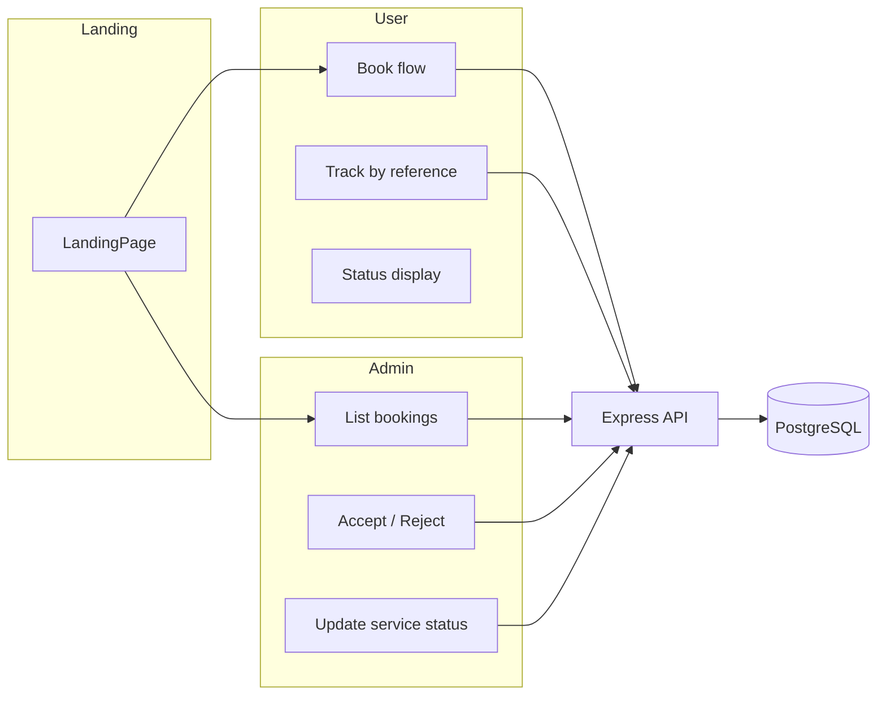

# Vehicle servicing booking app — documentation and architecture plan

You chose **two files**: [`SETUP_GUIDE.md`](SETUP_GUIDE.md) (setup through hosting) and [`INTERVIEW_PREP.md`](INTERVIEW_PREP.md) (concepts + dual-perspective technical flow). Below is what those files will contain and how the app should be shaped so a stranger can clone and run it on **Windows 11** or **macOS**.

---

## Language and simplicity constraints

- **No TypeScript** anywhere (client or server): only **JavaScript** (`.jsx` in React, `.js` in Node).
- **Plain React** only: functional components + hooks (`useState`, `useEffect`), **`react-router-dom`** for routes. **Avoid** Next.js, Remix, Gatsby, Redux, React Query, UI kits that assume TS, etc., unless the guides explicitly add one small dependency.
- **Scaffold command** (documented in setup guide): Vite’s **React (JavaScript)** template — e.g. `npm create vite@latest client -- --template react` (not `react-ts`).

---

## Recommended tech stack (free-friendly, resume-friendly)

| Layer | Choice | Why |
|-------|--------|-----|
| Frontend | **React (JS)** + **Vite** | Fast dev server; **plain JSX** without a compiler/types layer; simple `npm run dev`. |
| Backend | **Node.js LTS** + **Express** in **`.js`** | Same language as the browser tutorials; no `tsconfig` or build step for the API. |
| API shape | **REST + JSON** | Easiest to explain in interviews; `fetch` from React. |
| Database | **PostgreSQL** via **[Neon](https://neon.tech)** (free tier) | Persists data when the backend host restarts; better story than SQLite on ephemeral free containers. |
| ORM (optional but resume-friendly) | **Prisma** with **JavaScript** client | Schema and migrations in `schema.prisma`; app code stays `.js` (no requirement for TypeScript). |
| Local dev DB | **Neon** branch or Docker Postgres — the guide picks **one** path (Neon-only avoids Docker install issues on beginner Windows). |

**Versions to pin in the guides** (check [nodejs.org](https://nodejs.org) at build time for latest LTS, e.g. **22.x LTS**):

- **Node.js**: Current **LTS** (document exact version in `SETUP_GUIDE.md` and optional `.nvmrc`).
- **npm**: Ships with Node (or mention **pnpm** as optional).
- **Git**: Latest stable from [git-scm.com](https://git-scm.com).

---

## Repository layout (what the guides will describe)

```text
booking-app/
├── README.md                 # 5-line summary + links to SETUP_GUIDE + INTERVIEW_PREP
├── SETUP_GUIDE.md            # Full beginner setup (your requested guide)
├── INTERVIEW_PREP.md         # Concepts + flows for interviews
├── client/                   # Vite + React (JavaScript / .jsx only)
│   ├── package.json
│   └── src/
├── server/                   # Express API (.js only)
│   ├── package.json
│   ├── prisma/
│   │   └── schema.prisma     # Prisma schema language (not TS)
│   └── src/
└── .env.example              # SERVER_URL, DATABASE_URL (no secrets committed)
```

---

## Data model (minimal, matches your flows)

**Core idea:** No login → each booking needs a **public reference** (e.g. `BK-XXXX`) so the user can reopen the app and **look up** their booking.

Suggested tables / Prisma models:

- **Booking**: `id`, `referenceCode` (unique), `status` (enum), `createdAt`, fields for brand, model, odometerKm, serviceType, optional contact note if you add later.
- **Status enum** (single field on booking): e.g. `PENDING` → admin accepts → `ACCEPTED` | `REJECTED`; after acceptance: `VEHICLE_RECEIVED`, `SERVICE_IN_PROGRESS`, `SERVICE_COMPLETED`, `FINAL_TOUCHUP_DONE`.

Admin actions map to PATCH endpoints that only transition allowed states (simple validation in Express).

---

## App flows (implementation checklist for the guides)



- **Landing**: two navigation buttons — “User dashboard” / “Admin dashboard” (routes like `/` with links to `/user` and `/admin`).
- **User**: multi-step or single form → **Book now** → POST booking → show **reference code** prominently → “Track booking” input → GET by reference → read-only status timeline.
- **Admin**: table of `PENDING` (and optionally tabs for all states) → Accept/Reject → for accepted rows, dropdown or buttons for service milestones.

**CORS**: Express must allow the Vite dev origin (`http://localhost:5173`) and production frontend URL.

---

## Free hosting path (documented end-to-end)

Typical **zero/low-cost** combo:

1. **Frontend**: [Vercel](https://vercel.com) or [Netlify](https://netlify.com) — connect GitHub repo, build command `npm run build` in `client/`, set env `VITE_API_URL` to production API URL.
2. **Backend**: [Render](https://render.com) Web Service (free tier sleeps; cold starts acceptable for a demo) — build/start commands for `server/`, env `DATABASE_URL`.
3. **Database**: Neon — create project, copy connection string into Render env.

The setup guide will include **Windows vs Mac** notes where they differ:

- **Terminal**: PowerShell vs zsh; **path separators** are handled by tools (always use forward slashes in docs where universal).
- **Line endings**: Git `core.autocrlf` note for Windows.
- **Node install**: Official installer vs **nvm-windows** vs **fnm** (optional advanced subsection).

---

## Contents of [`SETUP_GUIDE.md`](SETUP_GUIDE.md) (outline)

1. **What you’re building** — one paragraph + link to user/admin flows.
2. **Prerequisites** — Node LTS, Git, a code editor (VS Code), GitHub account, free Neon/Render/Vercel accounts.
3. **Install Node & Git** — Mac + Windows 11 steps with verification (`node -v`, `npm -v`, `git --version`).
4. **Clone the repo** — `git clone …`, `cd`.
5. **Database** — Create Neon project; copy `DATABASE_URL`; explain `.env` vs `.env.example`.
6. **Backend** — `cd server`, `npm install`, `npx prisma migrate dev` (if Prisma), `npm run dev`, verify health route `GET /health`.
7. **Frontend** — `cd client`, `npm install`, create `.env` with `VITE_API_URL=http://localhost:PORT`, `npm run dev`.
8. **Run full stack locally** — order of terminals, common errors (CORS, wrong port, DB connection).
9. **Deploy** — Neon URL → Render env → deploy API → copy public API URL → Vercel env for frontend → redeploy.
10. **Troubleshooting** — port in use, firewall, Windows Defender, “works on Mac not Windows” checklist.

---

## Contents of [`INTERVIEW_PREP.md`](INTERVIEW_PREP.md) (outline)

1. **Elevator pitch** — problem, solution, stack, trade-offs (no auth for simplicity).
2. **User journey vs system journey** — short narrative then bullet technical steps (HTTP methods, JSON, DB row lifecycle).
3. **Concepts glossary** — each with *what*, *why*, *where in this project*:
   - Client/server, HTTP, REST, JSON
   - Environment variables, CORS
   - React (plain JS): JSX, components, `useState`, `useEffect`, routing (`react-router-dom`)
   - Node/Express: routes, middleware, request/response
   - Database: tables, primary key, enum/status field, migrations (Prisma)
   - Deployment: static hosting vs Node server, cold starts (Render free)
4. **Trade-offs & “what I’d add next”** — authentication, authorization (admin secret), payments, notifications; optional later: **TypeScript** or a validation library — for this project, simple checks in Express handlers keep the stack beginner-friendly.
5. **Demo script** — 60-second path through user booking + admin accept + status updates.

---

## Security note for the README (one line)

Without auth, **anyone with a reference code can view that booking** — acceptable for a learning demo; interview answer: “I’d add JWT or magic links for production.”

---

## What happens after you approve this plan

1. Scaffold `client/` (**Vite + React JS** template), `server/` (**Express `.js`**), Prisma schema, optional root scripts for `npm run dev` (optional).
2. Write **`SETUP_GUIDE.md`** and **`INTERVIEW_PREP.md`** to match the outlines above, with Mac + Windows 11 side-by-side where useful.
3. Add root **`README.md`** pointing beginners to `SETUP_GUIDE.md` first.

No authentication or payments per your scope; **booking reference code** is mandatory for the user dashboard story to make sense.
